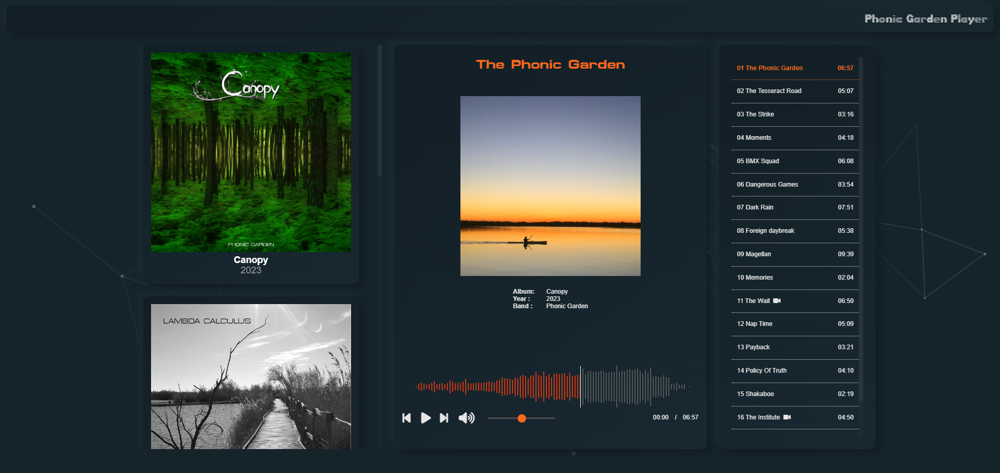

# Phonic Garden Player (PG-Player)

A simple **static site generator** to play your albums and video clips. 

- Extract all artworks and other metadata from your MP3/FLAC
- Responsive, respond to touch events on mobile (Pan Left/Right)
- Each tracks have its own URL so you can share it with your friends




# Prepare your albums

Put your albums in the folder `dist/albums`. 

- The folder for each album must follow the format `"<year> <title>"`
- Each track must follow the format `"<track id> <title>".mp3` (`.flac` is also supported. Limitations comes from [audiowaveform](https://github.com/bbc/audiowaveform#--input-filename--i-filename))
- You can also put any video clip in MP4 with the same name of a track.  `"<track id> <title>".mp4`
- ⚠️ ID3 metadata must be properly set (artworks are optionals). Use the freeware [mp3tag](https://www.mp3tag.de/en/) for that.

```
dist
  albums
    2001 Album 1
        folder.jpg   <=========== artwork for the album
        01 Title.mp3
        02 Title.mp3
        03 Title.mp3
        04 Title.mp3
        05 Title.mp3
        05 Title.mp4 <============ optional video clip
        06 Title.mp3
    2002 Album 2
        folder.jpg
        01 Title.mp3
        02 Title.mp3
        03 Title.mp3
        04 Title.mp3
        05 Title.mp3
        06 Title.mp3     	
```

# First step

Install NodeJs from [here](https://nodejs.org/en/download) then type:

```bash
npm install
```

# Generate meta-data

```bash
npm run peaks
```

Your albums folders will contains everything required for the static site to run properly:

```
dist
  albums
    index.json
    2001 Album 1
        folder.jpg
        01 Title.mp3
        01 Title.json <======= ID3 data with waveform peaks
        01 Title.jpg <======== artwork found in ID3 data
        02 Title.mp3
        02 Title.json
        03 Title.mp3
        03 Title.json
        ...
    2002 Album 2
        folder.jpg
        01 Title.mp3
        01 Title.json
        02 Title.mp3
        02 Title.json
        03 Title.mp3
        03 Title.json
        ...
```

To regenerate the `.json` simply delete the file.

# Generate the static site

Edit the file `config.json` to set the URL prefix used for your public website: here it is `https://your-host/player/`

```json
{
    "title": "Phonic Garden Player",
    "baseUrl": "/player"
}
```

Then generate the site in the folder `dist`:

```bash
>npm run build
```
The generator add a hash to do cache busting:
```
css/albums.css                => css/albums.13426DAB.css
css/main.css                  => css/main.5EADF0AD.css
css/player.css                => css/player.0B22FE95.css
css/playlist.css              => css/playlist.C2AA4439.css
css/track-info.css            => css/track-info.5644AF8A.css
css/video.css                 => css/video.7360E377.css
src/app.js                    => src/app.4A4A4FC1.js
src/dom.js                    => src/dom.0FF554CF.js
src/gesture.js                => src/gesture.13EAAA58.js
src/player.js                 => src/player.B3CF0169.js
```

# Test locally

💡 Locally, the `baseUrl` in `config.json`is ignored for convenience.

```bash
npm run peaks; npm run build; npm start
```

Connect to http://localhost:10092/

# Upload 

Put the content of the `dist` folder anywhere you want. 

⚠️ Make sure `baseUrl` in `config.json` was properly set during the build.

# Track URL

Depending on your server, you have to create a redirect to the right page. With apache you have to create a `.htaccess` like this:

```
ErrorDocument 404 /player/404.html
```

A track URL looks like this:

```
http://hostname/<album title>/<track title>
http://localhost:10092/Lambda%20Calculus/Terraforming
```

It has to be redirected to the page `404.html` which will go to the following URL:

```
http://localhost:10092/?play=Lambda%20Calculus/Terraforming
```

This URL will be handled by the player to jump to the right track. As soon as the track is displayed, the URL will be rewritten to the initial one:

```
http://localhost:10092/Lambda%20Calculus/Terraforming
```

# About the code

## Overview

This project try to be as simple as possible:

- No Webpack
- No popular frameworks (ReactJs, VueJS,...)
- No jQuery

## Dependencies

- [Wavesufer.js](https://wavesurfer-js.org/) (for the player)
- [Font Awesome](https://fontawesome.com/) (for the icons)
- [Plyr](https://plyr.io/) (for video clips)
- [Particles.js](https://vincentgarreau.com/particles.js/) (for the background)
- [Audiowaveform](https://github.com/bbc/audiowaveform) (to generate waveform data in JSON)

# Final note

*Phonic Garden* is my band name. I made this project to share musical ideas, privately, with friends.
